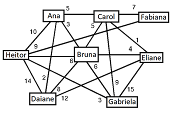

# Busca em grafo utilizando Prolog

Busca uma sequência de amigos (caminho) que o usuário pode interagir para aumentar a chance de ser apresentado a um usuário alvo.

Cada aresta é ponderada pelo inverso da proximidade/afinidade entre dois amigos. Quanto maior a proximidade/afinidade entre eles, menor é o peso da aresta.

O programa deve mostrar os caminhos entre dois usuários, a origem e o alvo, contendo para cada caminho:
- Quais amigos devem ser atingidos nesse caminho, incluindo o usuário do sistema (origem) e o usuário alvo;
- Afinidade total, somada a partir da afinidade de cada par de amigos adjacentes no caminho.

## Integrantes
- Ingo Guilherme Both Eyng
- Rebeca Cavalcante

## Exemplo do arquivo de dados



```prolog
% Formato do Arquivo de Dados de Existência de Ligação entre Amigos

% Simbologia:
% A: amigo de origem
% B: amigo de destino
% Afin: afinidade entre A e B; quanto menor o valor de Afin, maior a afinidade entre A e B

% laco(A,B,Afin).

laco(ana,ana,0).
laco(ana,bruna,3).
laco(bruna,ana,3).
laco(ana,heitor,10).
laco(heitor,ana,10).
laco(ana,daiane,2).
laco(daiane,ana,2).
laco(ana,carol,5).
laco(carol,ana,5).
laco(bruna,bruna,0).
laco(bruna,carol,5).
laco(carol,bruna,5).
laco(bruna,eliane,4).
laco(eliane,bruna,4).
laco(bruna,gabriela,6).
laco(gabriela,bruna,6).
laco(bruna,daiane,6).
laco(daiane,bruna,6).
laco(bruna,heitor,6).
laco(heitor,bruna,6).
laco(carol,carol,0).
laco(carol,fabiana,7).
laco(fabiana,carol,7).
laco(carol,eliane,1).
laco(eliane,carol,1).
laco(carol,gabriela,9).
laco(gabriela,carol,9).
laco(daiane,daiane,0).
laco(daiane,heitor,14).
laco(heitor,daiane,14).
laco(daiane,eliane,12).
laco(eliane,eliane,0).
laco(eliane,daiane,12).
laco(eliane,gabriela,15).
laco(gabriela,gabriela,0).
laco(gabriela,eliane,15).
laco(fabiana,fabiana,0).
laco(fabiana,heitor,9).
laco(heitor,fabiana,9).
laco(heitor,heitor,0).
laco(gabriela,heitor,3).
laco(heitor,gabriela,3).
```

## Requisitos

1. Baixar o programa [SWI-Prolog](https://www.swi-prolog.org/Download.html) para seu SO.
2. Instalar o programa SWI-Prolog

## Preparação para execução

1. Abrir o programa SWI-Prolog
2. Carregar o arquivo `main.pl` através da opção `File > New`
3. Na janela nova que abriu, compilar o código através da opção `Compile > Compile Buffer`
4. Repita os passos 2 e 3, porém com o arquivo de dados próprio (desde que siga o modelo do exemplo acima) ou com arquivo de exemplo que fornecemos `base_example.pl`

## Execução

Para consultar um caminho entre duas pessoas, utilize, no console do SWI-Prolog, o comando `caminho(P1, P2, D, C).` e tecle `ENTER`.

Onde `P1` é a pessoa inicial, a origem. `P2` é a pessoa destino, o alvo. `D` e `C` são as variaveis onde as respostas serão retornadas. `D` representando a distância total (Afinidade total) e `C` representando o caminho encontrado.

### Exemplo de uso

Exemplo conforme o exemplo fornecido.

```prolog
caminho(ana, heitor, Afinidade, Caminho).
```

A resposta seria:

```prolog
Afinidade = 10,
Caminho = [ana, heitor]
```

Você tem a opção de visualizar mais respostas digitando `;` ou se a resposta atual já foi satisfatória e deseja encerrar, digitando `.`

## Documentação

O código está comentado e explicado dentro do próprios arquivos `.pl` através de comentários em Prolog (`%`)